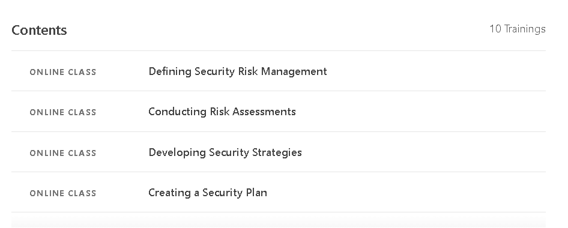
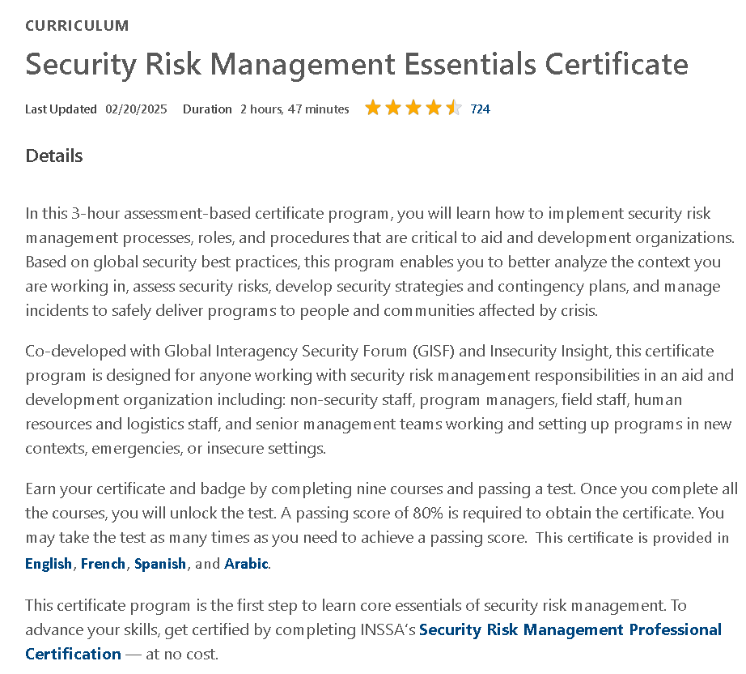

# 🛡️ Security Risk Management Essentials - DisasterReady  

This repository contains structured notes, labs, case studies, and resources from the **“Security Risk Management Essentials”** course offered by **DisasterReady**.  

---

## 📚 Notes  

- 📝 [`01-introduction-to-risk-management.md`](./notes/01-introduction-to-risk-management.md) – Course intro & foundations  
- 📝 [`02-risk-identification.md`](./notes/02-risk-identification.md) – Risk identification methods  
- 📝 [`03-risk-assessment.md`](./notes/03-risk-assessment.md) – Assessment framework  
- 📝 [`04-risk-analysis-methods.md`](./notes/04-risk-analysis-methods.md) – Qualitative & quantitative methods  
- 📝 [`05-risk-evaluation.md`](./notes/05-risk-evaluation.md) – Prioritization & evaluation  
- 📝 [`06-risk-treatment.md`](./notes/06-risk-treatment.md) – Risk treatment strategies  
- 📝 [`07-monitoring-review.md`](./notes/07-monitoring-review.md) – Continuous monitoring  
- 📝 [`08-communication-consultation.md`](./notes/08-communication-consultation.md) – Risk communication  
- 📝 [`09-crisis-management.md`](./notes/09-crisis-management.md) – Crisis management essentials  
- 📝 [`10-business-continuity.md`](./notes/10-business-continuity.md) – Continuity planning  
- 📝 [`11-incident-response.md`](./notes/11-incident-response.md) – Incident handling  
- 📝 [`12-security-governance.md`](./notes/12-security-governance.md) – Governance frameworks  
- 📝 [`13-compliance-standards.md`](./notes/13-compliance-standards.md) – Compliance & standards  
- 📝 [`14-case-examples.md`](./notes/14-case-examples.md) – Practical examples  
- 📝 [`15-final-assessment.md`](./notes/15-final-assessment.md) – Final wrap-up  

---

## 🧪 Labs  

- 💻 [`risk-assessment-exercises.md`](./labs/risk-assessment-exercises.md) – Risk identification & matrix  
- 💻 [`scenario-based-labs.md`](./labs/scenario-based-labs.md) – Data breach, natural disaster, insider threat  
- 💻 [`hands-on-practice.md`](./labs/hands-on-practice.md) – Risk register, BCP, IR tabletop  

---

## 📋 Extras  

- 📄 [`case-studies.md`](./extras/case-studies.md) – Real-world case studies (WannaCry, Maersk, Haiti)  
- 📄 [`resources.md`](./extras/resources.md) – Standards, books, frameworks, tools  
- 📄 [`timeline.md`](./extras/timeline.md) – Week-by-week study roadmap  

---

## 📖 Documentation  

- 📘 [`index.md`](./docs/index.md) – Course overview & objectives  
- 📘 [`syllabus.md`](./docs/syllabus.md) – Full syllabus  
- 📘 [`roadmap.md`](./docs/roadmap.md) – Learning roadmap  
- 📘 [`glossary.md`](./docs/glossary.md) – Terminology & definitions  
- 📘 [`references.md`](./docs/references.md) – References & resources  

---

## 📸 Screenshots  

| Section             | Screenshot |
|---------------------|------------|
| 📚 Course           |  |
| 📘 Curriculum       |  |

---

## 📜 Certificate  

📄 [`Security Risk Management Essentials Certificate`](./cert/Security%20Risk%20Management%20Essentials%20Certificate.pdf)  

---

## 🗣️ Personal Review  

The **Security Risk Management Essentials** course provides a solid foundation in organizational resilience and risk management.  
- ✅ Clear introduction to ISO 31000, NIST frameworks, and best practices.  
- ✅ Balanced focus between theory (risk models, governance) and practice (BCP, crisis scenarios).  
- ✅ Useful case studies (WannaCry, Maersk, Haiti earthquake) reinforce concepts.  
- ⚠️ Entry-level course, may be too basic for advanced security practitioners.  

👉 Overall, this course is highly recommended for professionals in **humanitarian, NGO, and IT governance contexts**.  

---

## ✍️ Author  

**Thành Danh** – Red Team Learner & Security Researcher  

- GitHub: [@ngvuthdanhh](https://github.com/ngvuthdanhh)  
- Email: ngvu.thdanh@gmail.com  

---

## 📄 License  

This project is licensed under the terms of the **MIT License**.  
See [`LICENSE`](./LICENSE) for full details.  

© 2025 ngvuthdanhh. All rights reserved.  
